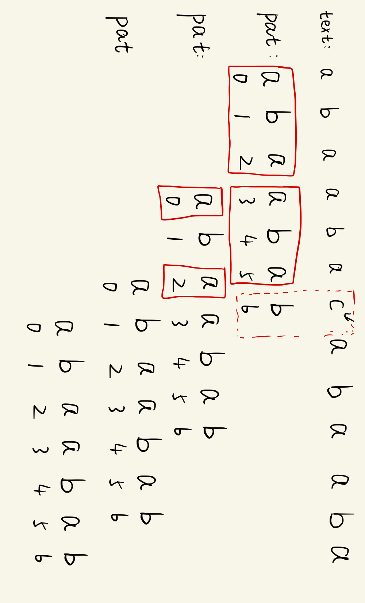
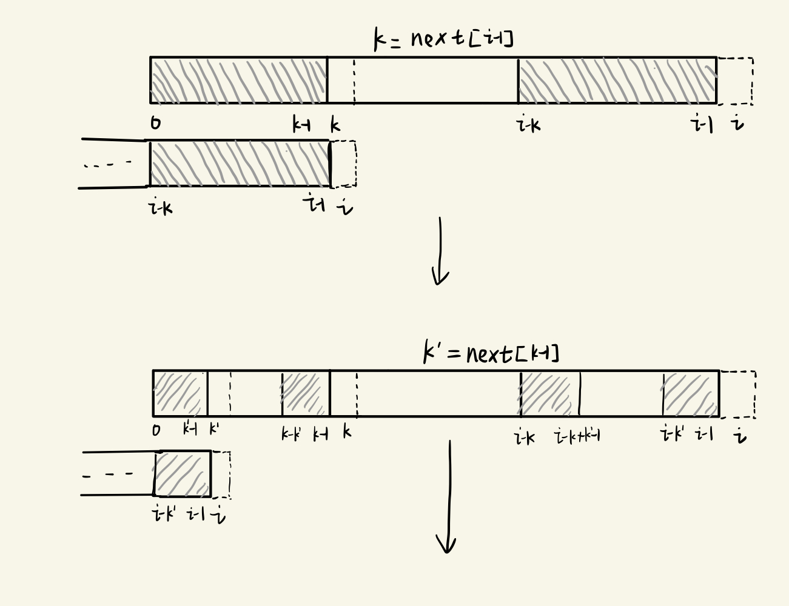

# kmp笔记

`kmp`算法是巧妙的字符串匹配算法。当模式串(`pattern`)和文本(`text`)不匹配时，利用模式串的性质得到下一个应该比较的模式串字符，文本串指针不回退，达到线性的运行效率。

## brute force 解法
text:    `abaabacabaabaabaabab`

pattern: `abaabab`

暴力解法中，比较第6个字符发现不匹配(`c` 和 `b`)，文本指针回到1，模式串指针回到0，重新开始匹配。代码实现为：
```c++
int search(const std::string& text, const std::string& pat) {
    for(int i = 0; i <= text.size() - pat.size(); ++i) {
        for(j = 0; j < pat.size(); ++j) {
            if (text[i+j] != pat[j]) {
                break;
            }
        }
        if (j == pat.size()) {
            return i;
        }
    }
    return -1;
}
```
发现不匹配时，文本串指针都需要退回(back up)，效率低。

## kmp nondeterministic finite state machine(nfa)解法
kmp算法利用已有的匹配信息避免文本串指针回溯。即当`text[i]`和`pattern[j]`不匹配时，有`text[i-j:i]`和`pattern[0:j-1]`匹配，在上面的例子中，`i = 6, j = 6`， `text[i] != pattern[j]`，已匹配的前缀就是`abaaba`。观察到已经匹配的字符串中，有前缀`aba`和后缀`aba`匹配，模式串指针回退到3继续匹配。此时`text[6]`和`pattern[3]`仍然不匹配，需要用`pattern[0:2]`的前后缀匹配信息，回退模式串指针到1。。。知道模式串指针为0或者模式串字符和文本字符匹配

<div align=center></div>

现在的问题是，对于模式串`pattern`能否提前计算出`next`数组，`k = next[i], k != i+1`表示在`pattern[0:i]`中有**最长**的前缀和后缀`pattern[0:k-1] = pattern[i-k+1:i]`。首先有`next[0] = 0`。计算`next[i]`可以利用`k = next[i-1]`，即有`pattern[0:k-1] = pattern[i-k:i-1]`。如果`pattern[k] = pattern[i]`，那么`next[i] = k+1`。如果`pattern[k] != pattern[i]`呢？
这时候要查看`pattern[i-k:i-1]`的后缀和`pattern[0:k-1]`的前缀匹配的长度，因为有`pattern[0:k-1] = pattern[i-k:i-1]`，所以要查看`pattern[0:k-1]`的后缀和`pattern[0:k-1]`的前缀匹配的长度，这个信息就是`t = next[k-1]`， 如果`pattern[t] = pattern[i]`，那么`next[i] = t+1`。如果`pattern[t] != pattern[i]`呢？所以这是个迭代`k`的过程。

<div align=center></div>

```latex
next[0] = 0
对于i > 0, k = next[i-1], 如果pattern[k] != pattern[i] k <- next[k-1]
否则 next[i] = k+1
```

代码实现为
```c++
class KMP {
   private:
    std::string pat_;
    std::vector<int> next_;
    void GetNext() {
        int n = pat_.size();
        for (int i = 1; i < n; ++i) {
            int k = next_[i - 1];
            while (k != 0 && pat_[k] != pat_[i]) {
                k = next_[k - 1];
            }
            //判断 k!= 0 避免 pat_[0] != pat_[i]，计算next_[-1]
            if (pat_[k] == pat_[i]) {
                k ++;
            }
            next_[i] = k;
        }
    }
   public:
    KMP(const std::string& pat) : pat_(pat), next_(pat.size(), 0) {      
        GetNext(); 
    }
    // 给定文本串，返回模式串在文本串中出现的位置
    std::vector<int> Search(const std::string& txt) {
        std::vector<int> pos;
        int m = txt.size();
        int c = 0;  //对于i, c
                    //表示已经匹配的字符数，或者和txt[i]比较的模式串字符下标
        for (int i = 0; i < m; ++i) {
            while (c && pat_[c] != txt[i]) {
                c = next_[c - 1];
            }
            if (pat_[c] == txt[i]) {
                c ++;
            }
            if (c == pat_.size()) {
                pos.push_back(i - c + 1);
                c = next[c-1];
            }
        }
        return pos;
    }
};
```